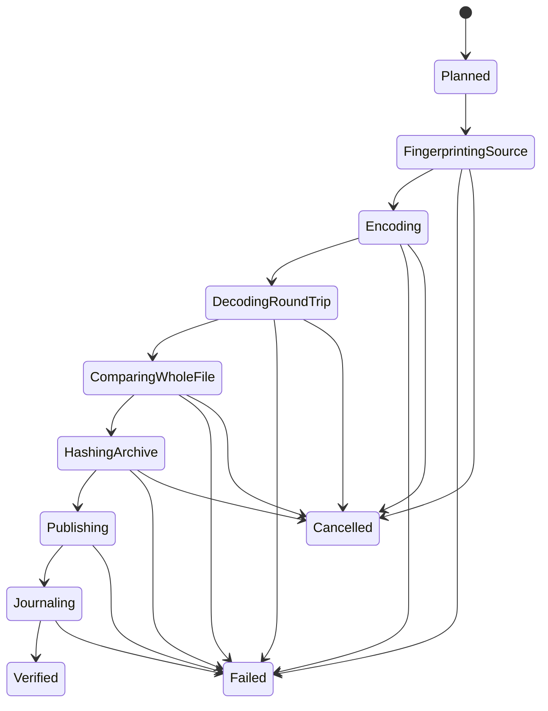

# Architecture

## 1. Architectural goals

WavCrusher’s architecture exists to make unsafe states difficult to represent and archival evidence easy to review. It favors explicit stages, narrow adapters, immutable data, and standard files over framework cleverness.

Primary qualities:

- Verified source-to-archive evidence.
- Path containment.
- Transactional output publication.
- Independent whole-file verification.
- Crash-resumable evidence.
- UI responsiveness.
- Open recovery without the app.
- Testability with real WavPack integration at the boundary.

## 2. System context

```text
┌──────────────┐       read-only       ┌──────────────────┐
│ Source tree  │ ────────────────────> │ WavCrusher        │
│ *.wav        │                       │ WinForms + engine │
└──────────────┘                       └────────┬─────────┘
                                               │ direct process invocation
                                      ┌────────▼─────────┐
                                      │ wavpack/wvunpack │
                                      │ pinned sidecars   │
                                      └────────┬─────────┘
                                               │ verified writes
                                      ┌────────▼─────────┐
                                      │ Destination tree │
                                      │ *.wv + evidence   │
                                      └──────────────────┘
```

There is no server, account service, database service, cloud API, or telemetry endpoint.

## 3. Solution structure

```text
src/
  WavCrusher.Domain/
  WavCrusher.Application/
  WavCrusher.Infrastructure/
  WavCrusher.WavPack/
  WavCrusher.WinForms/
```

### WavCrusher.Domain

Pure domain types and rules:

- Validated roots and relative paths.
- Plans, statuses, stages, evidence, and typed failure codes.
- Archive profile identity.
- Hash/tool identity value objects.
- State transitions and aggregate invariants.

It references only the base class library and has no filesystem, JSON, process, UI, or WavPack concepts beyond neutral tool evidence.

### WavCrusher.Application

Use cases and ports:

- Scan and plan.
- Execute archive operation.
- Resume operation.
- Audit archives.
- Restore archives.
- Query operation/report state.

Interfaces include filesystem views, hasher, WavPack encoder/decoder, journal, manifest repository, clock, free-space provider, and temp-workspace provider.

### WavCrusher.Infrastructure

Windows/.NET implementations:

- Safe filesystem enumeration.
- Windows path and reparse-point inspection.
- Streaming SHA-256.
- File identity/snapshot checks.
- Atomic file persistence.
- JSON serialization.
- Journal flushing.
- Disk free-space queries.
- Bounded structured logging.

### WavCrusher.WavPack

External tool adapter:

- Dependency metadata and hash validation.
- Exact argument construction.
- Process lifecycle and cancellation.
- Output/progress parsing.
- Exit/result mapping.
- Encode/decode/test requests.

No other project launches WavPack directly.

### WavCrusher.WinForms

Presentation and composition root:

- Forms, user controls, dialogs, grid models.
- Presenters/view-models and UI state.
- Dependency injection composition.
- Settings views and local help.

It must not perform hashing, filesystem traversal, archive publication, or ad hoc process invocation.

## 4. Dependency direction

```text
WavCrusher.Domain
      â–²
      │
WavCrusher.Application
   â–²       â–²       â–²
   │       │       │
Infrastructure  WavPack  WinForms
                         (composition)
```

Infrastructure and WavPack implement ports owned by Application. WinForms consumes Application use cases and registers concrete adapters.

No cyclical project references are permitted.

## 5. Key components

### RootValidator

- Canonicalizes roots.
- Checks existence/access.
- Rejects equality and nesting.
- Inspects reparse-point risks.
- Returns typed diagnostics.

### FileTreeScanner

- Streams candidates and scan diagnostics.
- Does not follow directory reparse points.
- Matches `.wav` case-insensitively.
- Avoids keeping complete file contents or open handles.

### ArchivePlanner

- Validates each relative path.
- Maps source to destination.
- Detects collisions and existing outputs.
- Calculates totals and estimated space.
- Produces an immutable plan.

### ArchiveCoordinator

- Owns operation state and bounded scheduling.
- Does not implement item internals.
- Supports pause scheduling, cancellation, progress aggregation, and resume.

### ArchiveItemPipeline

- Owns the single-item state machine.
- Takes a planned item and produces complete evidence or a typed failure.
- Is the only component allowed to publish a final archive.

### FileHasher

- Streams SHA-256.
- Reports byte progress.
- Returns digest plus observed length.
- Never changes source timestamps intentionally.

### WavPackToolchain

- Checks expected binaries.
- Encodes temporary archive.
- Decodes verification/restore WAV.
- Runs decoder integrity checks.

### JournalWriter

- Appends one UTF-8 JSON record per line.
- Flushes terminal records.
- Uses monotonically increasing sequence values per operation.

### ManifestRepository

- Reads compatible manifests.
- Validates schema version.
- Writes snapshots transactionally.
- Rebuilds snapshots from journals.

### PackageVerifier

- Decompresses and extracts the final `.tar.gz` package after creation.
- Compares extracted payload file hashes against staged `.wv` and manifest/report content.
- Blocks completion if packaged bytes differ from staged content.

### ReportGenerator

- Generates JSON and static HTML summaries from immutable operation evidence.
- Supports redacted root/path mode.

## 6. Archive state machine



A final filename is absent until `Publishing`. `Verified` is only reached after durable terminal journaling.

## 7. Transaction boundaries

### Archive content transaction

1. Create destination directory beneath validated root.
2. Create unique temporary archive in that directory.
3. Encode and verify.
4. Decode to operation temp workspace.
5. Compare whole-file hash.
6. Hash temporary archive.
7. Move temporary archive to final name with no overwrite.
8. Journal success.

If step 8 fails after publication, the archive exists but the operation is not allowed to silently claim complete. Resume must classify the orphan final file, verify it, and reconcile evidence or report manual attention. Design tests around this narrow post-publication failure window.

### Manifest transaction

Write a complete snapshot to a sibling temp file, flush, and atomically replace the prior snapshot. The append-only journal remains the recovery source if snapshot replacement fails.

## 8. Concurrency model

- One `ArchiveCoordinator` per active operation.
- A bounded channel/queue of ready items.
- A small worker pool; default chosen after benchmark, likely 1–2 for `-x6` to limit disk/CPU contention.
- Each item has isolated temp names and workspace.
- Journal writes serialize through one writer.
- UI receives throttled progress snapshots rather than every byte event.
- Cancellation token propagates to scanner, hasher, process adapter, and persistence.

Parallelism must not reorder evidence semantics. Each journal record carries item and sequence identity.

## 9. Process boundary

Use `ProcessStartInfo` with:

```text
UseShellExecute = false
CreateNoWindow = true
RedirectStandardOutput = true
RedirectStandardError = true
ArgumentList = structured arguments
```

The executable path comes from validated dependency metadata beneath the installation directory, not PATH search. Standard streams are drained asynchronously to avoid deadlock. Retained diagnostics are bounded, while important parsed events are structured.

Cancellation attempts graceful termination only if the CLI has a documented safe mechanism; otherwise terminate the complete process tree and treat any output as incomplete.

## 10. Path model

Paths are boundary objects, not arbitrary strings.

- `NormalizedAbsolutePath` stores a canonical Windows absolute path.
- `ValidatedRelativePath` cannot be rooted and cannot contain traversal.
- Persisted paths use `/` separators.
- Display paths may preserve user-friendly casing.
- Filesystem comparison uses Windows case-insensitive rules.
- A final containment check is performed after combining a root and relative path.

Manifest input is untrusted and must go through the same constructors.

## 11. Evidence model

A successful item includes:

- Source relative path.
- Original file byte length.
- Original complete-file SHA-256.
- Optional WavPack/raw-audio MD5.
- Source timestamps/attributes observed.
- Archive relative path.
- Archive byte length.
- Archive SHA-256.
- Restored byte length and SHA-256.
- Archive profile ID.
- WavPack executable version and hash.
- Start/end UTC timestamps and duration.
- Verification stages and outcomes.

Evidence is immutable once a terminal record is written. Later audits add new audit records rather than rewriting history.

## 12. Error model

Expected failures become typed results, for example:

```text
InvalidRoot
RootOverlap
ReparsePointSkipped
AccessDenied
UnsupportedWave
SourceChanged
DestinationConflict
InsufficientSpace
ToolMissing
ToolHashMismatch
ToolVersionMismatch
EncoderFailed
DecoderFailed
RoundTripHashMismatch
ArchiveHashFailed
PublishFailed
JournalWriteFailed
Cancelled
UnknownFailure
```

Each carries safe diagnostics, stage, retry guidance, and the original exception type/message where useful. Exceptions still represent unexpected programming/platform failures but are converted at operation boundaries.

## 13. UI architecture

Use a passive-view or presenter pattern:

- Views expose events and render immutable screen state.
- Presenters call application use cases and translate domain state to user text.
- Long operations run asynchronously.
- UI-thread marshaling is centralized.
- Grid rows use stable item IDs and virtualized retrieval where needed.
- Dialog services abstract native folder and message dialogs for testing.

Avoid a “God Form” containing workflow logic.

## 14. Configuration

Configuration is a versioned JSON file in an appropriate per-user application-data folder. It contains only non-dangerous preferences:

- Worker count within validated limits.
- Last source/destination locations.
- Report redaction preference.
- UI window/layout preferences.
- Optional temporary workspace root.

The canonical archive profile is compiled/declared as a versioned product policy, not editable free-form command arguments.

## 15. Logging

Structured operational logging is separate from archival evidence.

- Logs can rotate and be deleted.
- Journals/manifests are user archive artifacts.
- Log paths may contain sensitive information; provide a redacted support bundle.
- Do not log entire environment variables or arbitrary command lines.
- Store arguments as a safe structured list when diagnostic capture is enabled.

## 16. Future extension points

Potential later work:

- Cross-platform CLI using Application/Domain layers.
- Additional audit scheduling.
- PAR2/redundancy integration as a separate layer.
- Other lossless source formats under distinct product profiles.
- Optional embedded library adapter instead of CLI.

None may weaken standard `.wv` output or whole-file verification for WavCrusher’s WAV profile.
